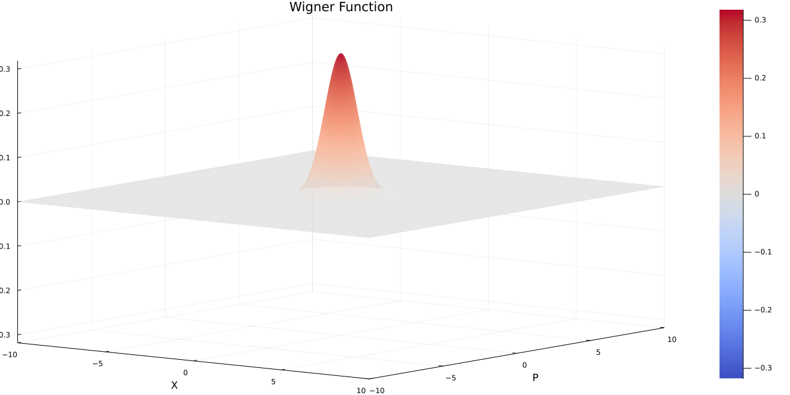

## Source code status

## Render Wigner function

The Wigner function is calculate by Moyal function in Fock basis

$$
W_{mn}(x, p) = \frac{1}{2\pi} \int_{-\infty}^{\infty} dy e^{-ipy/h} \psi_m^*(x+\frac{y}{2}) \psi_n(x-\frac{y}{2})
$$

Owing to the Moyal function is a generalization of the Wigner function. We can therefore implies that

$$
W(x, p) = \sum_{m, n} \rho_{m, n} W_{m, n}(x, p)
$$

The squeezed vacuum state shown as below

## Example

* [Get Started](notebook/get_started.jl.html)
* [Generate training data](notebook/training_data.jl.html)
